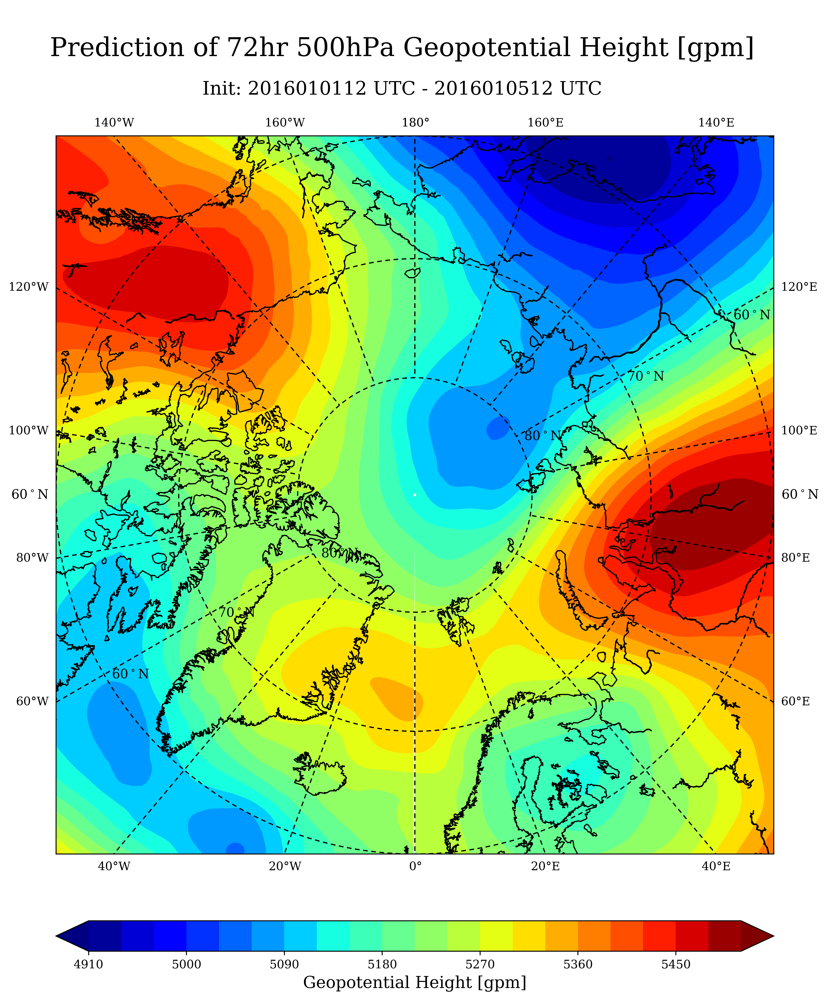
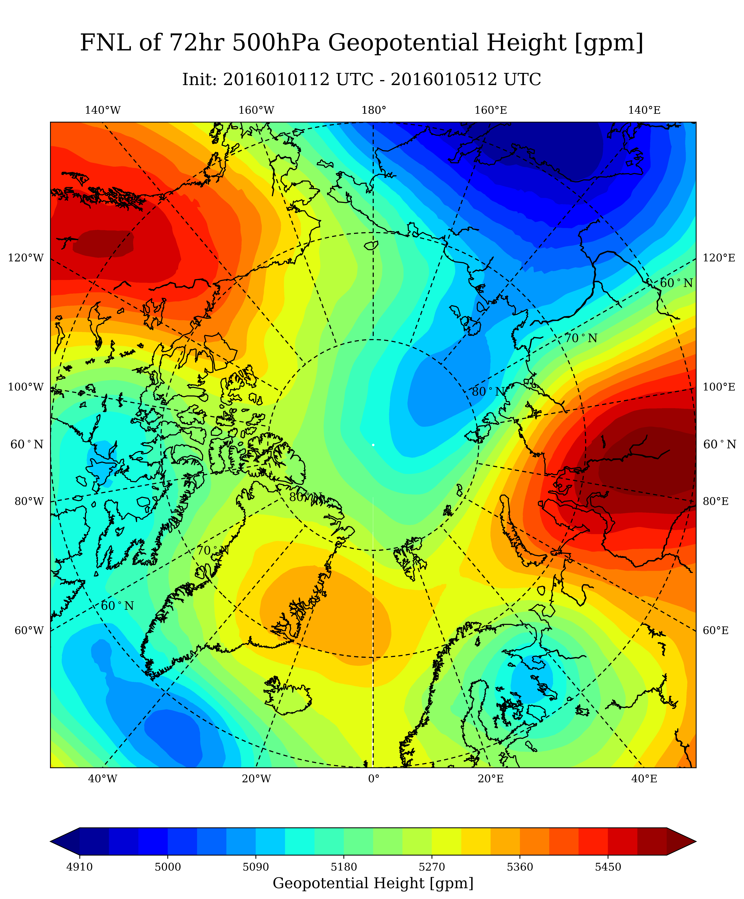
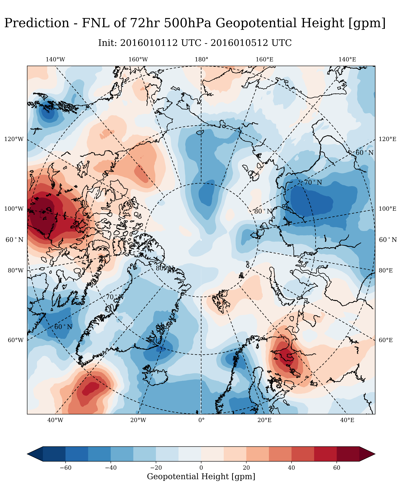

<!--
 * @Description: README
 * @Author: Hejun Xie
 * @Date: 2020-04-23 20:31:50
 * @LastEditors: wanghao
 * @LastEditTime: 2020-07-09 16:45:23
 -->
# GRAPES预报场与FNL分析场诊断画图脚本V1.9.0

----------
Developers and Contributors
----------

#### 王皓 - 中国气象局数值预报中心
 
#### 谢和俊 - 浙江大学地球科学学院

# version info
1.9.0  alpha

1.9.1  增加快速融合降水观测

1.9.2  增加试验间作差功能

## 1、数据提取模块

extractdata.py

从 GRAPES postvar 数据中根据通配的ctl文件，提取诊断绘图提取所需的变量, 并存储为nc格式的数据。
放置在提取数据目录下。注意用户需给定初始是时刻的通配ctl,程序会解析初始时刻的ctl并自动在数据文件夹下生成对应时次的通配ctl。如果不存在初始时刻的ctl, 程序会抛出异常并中断。

## 2. 绘图模块

plotmap.py

plot_data 函数 绘制单个变量的不同区域的地图投影填色图。
find_clevels 函数 自动根据输入的数据和绘图区域设置填色图的色标范围。

## 3. 工具模块

utils.py

用于暂时存储画图所需的变量的一个装饰器类 DATAdecorator。 
防止调整绘图脚本时重复进行数据计算, 方便绘图调试。
如果不需要重新获取数据，可将装饰器参数中的speedup选项设置为 False

读取配置文件的函数 config。

## 4. ASCII数据I/O模块

asciio.py

主要负责ASCII编码的观测数据的读取和分析

## 5. 导出量模块

derived_var.py

主要负责生成由原始预报量导出的导出预报量

## 6. 数据类模块

data.py

主要负责处理基础的数据类

## 7. 合成图模块

make_comp.py

主要负责合成拼图和动图

## 6. 绘图脚本模块

plot_postvar.py

目的
----------

计算GRAPES不同起报时间集合下不同预报时效的平均预报场
并与对应预报时效下的FNL再分析平均场进行对比

层次结构
----------

包含三个形式上的函数, 和一个主程序脚本
get_GRAPES_data, get_FNL_data, get_OBS_data

get_GRAPES_data 
读取GRAPES提取出的nc格式的数据，并计算起报时间集合下不同预报时效的平均预报场

get_FNL_data
读取FNL再分析数据，并线性插值到GRAPES网格下,计算起报时间集合下不同预报时效的平均预报场

get_OBS_data
读取NMC观测数据

主程序对GRAPES预报场和FNL再分析场分别进行画图，并分析两者的差值画图
主程序还可以读取观测数据进行个例降水的比较画图

目前将所需修改的内容提取到配置文件中，存放在同级目录的config文件夹下，包含两个配置文件：config.yml 用户配置文件
devconfig.yml 开发者配置文件

- config.yml, 画图设置和提取数据设置。
```
# 起报时间信息
start_ddate: '2016010112'  # yyyymndd
end_ddate  : '2016010512'  # yyyymndd

# 起报时间间隔
fcst_step: 24 # hours

# GRAPES数据路径 
ctlfile_dir: './87_fcst_ctl/'

# GRAPES数据转换路径
exdata_dir: './ex_data/'

# FNL数据路径
fnl_dir: './fnl_data/'

# 提取变量和统计变量
ex_vars  : ['u','v','t','h','w','q2','rainc','rainnc']

# Units:
# u, v [m/s]
# t [K]
# h [gpm]
# w [cm/s]
# q [g/kg]
# 24hrain [mm]
st_vars: ['u','v','t','h','w','q','24hrain']

# 提取等压层和统计等压层
ex_levels: [1000.,925.,850.,700.,600.,500.,400.,300.,200.,100.,50.,10.]
st_levels: [500.]

# 预报时长
fcst: [0,72] # hours

# 图片类型
pic_prefix: 'png'
# 图片质量
plot_dpi: 300
# 是否制作拼图
make_comp: True
# 是否制作动图 
make_gif: True

# 图片路径
pic_dir: './pic'
# 原始图片路径
origin_dir: 'origin'
# 拼图路径
comp_dir: 'comp'
# 动图路径
gif_dir: 'gif'
# 案例图路径
case_dir: 'case'

# 画图设置

# 画图前是否清理原出图文件夹
clean_plot: True


# 画图区域设置
  "u v t h w q": ['Global', 'E_Asia', 'North_P', 'South_P']
  "24hrain shf phf" : ['Global', 'E_Asia']
  "t2m" : ['Global']

# 画图类型设置 
plot_types: ['P', 'F', 'PMF']

# 画图类型名称
plot_types_name:
  P:    'Prediction'
  F:    'FNL'
  PMF:  'Prediction - FNL'

# 填色色标间隔
clevel_step:
  u: 2
  v: 2
  t: 1
  h: 30
  q: 0.1

clevel_step_PMF:
  u: 1
  v: 1
  t: 0.3
  h: 10
  q: 0.1

# 变量名称
variable_name:
  t:  'Temperature [K]'
  u:  'U Wind [m/s]'
  v:  'V wind [m/s]'
  h:  'Geopotential Height [gpm]'
  24hrain: '24hours precipitation [mm]'

# 个例画图
plot_cases: True
# 观测文件路径
obs_dir: './nmc_obs/'
# 个例起报时间
case_ini_times: ['2016010112']
# 个例预报时间
case_fcst_hours: [12,36,60]
# 是否使用新配色方案
newcolorscheme: False
```

使用方式
----------
用户需在config.yml中给定初始和结束时刻的时间信息，并给定模式数据所在的路径。一般只需要修改这两块就可以。

1. 提取postvar数据
修改./config/config.yml后，运行python extractdata.py即可，
```python
python extractdata.py
```

2. 画图
修改./config/config.yml后，运行python plot_postvar.py即可，
```python
python plot_postvar.py
```


图形展示
----------
- Prediction

- FNL

- Prediction - FNL


- Composite for comparison


- Precipitation


- observation vs prediction precipitation (old color scheme) 


- observation vs prediction precipitation (new color scheme) 
